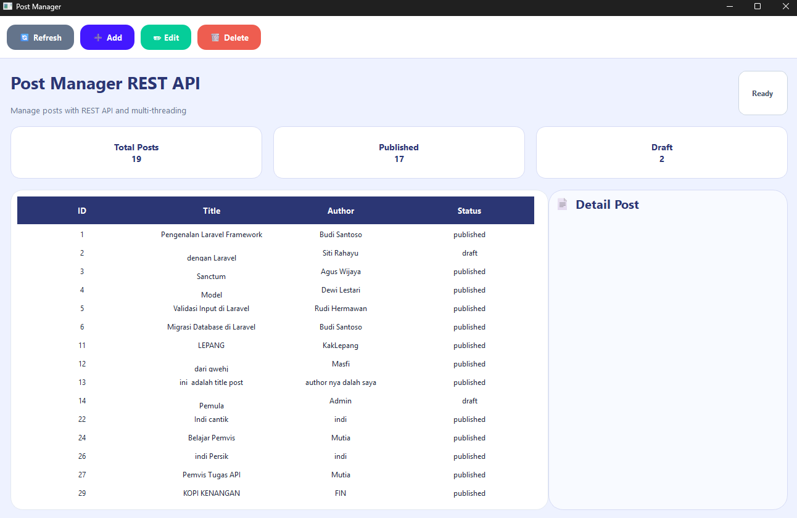
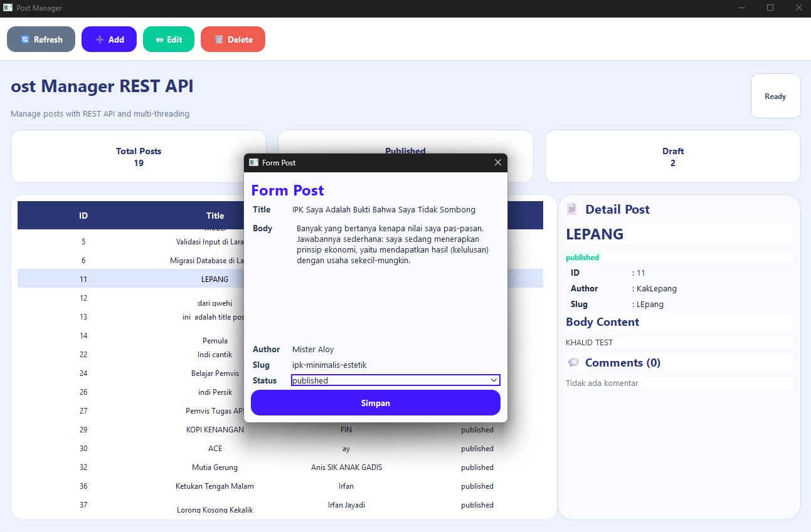
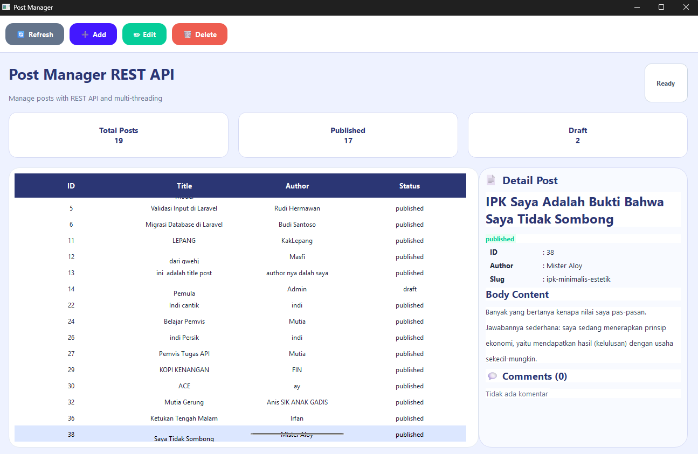
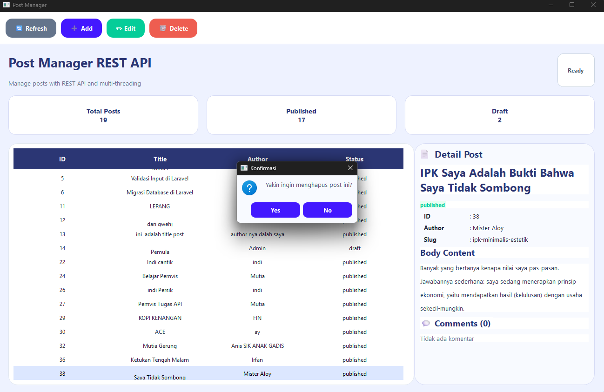

# 📰 Post Manager REST API

Post Manager REST API merupakan aplikasi desktop berbasis Python dan PySide6 yang digunakan untuk mengelola data post melalui REST API. Aplikasi ini mendukung operasi CRUD (Create, Read, Update, Delete) dan menerapkan multi-threading menggunakan QThread agar aplikasi tetap responsif dan tidak freeze saat melakukan request API.

---

# ✨ Fitur Aplikasi

## ✅ GET Posts
Menampilkan seluruh data posts dari REST API ke dalam tabel.

## ✅ Detail Post
Menampilkan detail lengkap post ketika user memilih salah satu data pada tabel.

## ✅ Tambah Post
Menambahkan post baru melalui form dialog menggunakan method POST.

## ✅ Edit Post
Mengubah data post yang dipilih menggunakan method PUT.

## ✅ Hapus Post
Menghapus data post menggunakan method DELETE dengan konfirmasi QMessageBox.

## ✅ Threading
Semua request API dijalankan menggunakan QThread sehingga UI tetap responsif.

## ✅ State & Error Handling
Menampilkan loading state dan pesan error ketika request gagal atau timeout.

---

# 🛠 Teknologi yang Digunakan

| Teknologi | Fungsi |
|---|---|
| Python | Bahasa pemrograman utama |
| PySide6 | Framework GUI desktop |
| Requests | HTTP request ke REST API |
| REST API | Sumber data post |
| QThread | Multi-threading |
| QSS | Styling antarmuka |

---

# 🌐 API Endpoint

API yang digunakan:

```text
https://api.pahrul.my.id/api/posts
```

Method yang digunakan:

| Method | Endpoint | Fungsi |
|---|---|---|
| GET | /api/posts | Menampilkan semua post |
| GET | /api/posts/{id} | Detail post |
| POST | /api/posts | Tambah post |
| PUT | /api/posts/{id} | Edit post |
| DELETE | /api/posts/{id} | Hapus post |

---

# 📁 Struktur Project

```text
T6-week11/
│
├── main.py
│
├── api/
│   └── api_service.py
│
├── ui/
│   ├── main_window.py
│   ├── post_dialog.py
│   └── worker.py
│
├── styles/
│   └── style.qss
│
├── screenshots/
│
├── README.md
│
└── requirements.txt
```

---

# ▶ Cara Menjalankan Program

## 1. Install Dependency

```bash
pip install -r requirements.txt
```

---

## 2. Jalankan Program

```bash
python main.py
```

---

# 📸 Screenshot Aplikasi

## 🏠 Tampilan Utama




---

## ➕ Form Tambah Post




---

## 📄 Detail Post




---

## 🗑 Delete Confirmation




---

# 👨‍💻 Author

**Dodi Wijaya**  
NIM: F1D02310047

---

# 📌 Keterangan

Project ini dibuat untuk memenuhi tugas:

```text
Tugas 5 — Threading & REST API
Pemrograman Visual
```